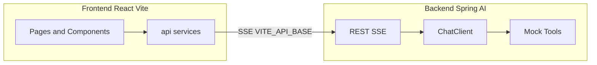

# 智能体项目搭建与初版需求设计

## 一、Phase 1：Discovery（初版需求，从页面提炼）

参考 [营营无忧.html](/Users/sunbin/Desktop/产研2025/营营无忧.html) 的标题、导航、场景与文案，产出初版需求并落稿到 `docs/feature-dev/research-agent/01-discovery.md`。

**核心功能（从页面归纳）**

- **工作台布局**：左侧固定侧栏（Logo、导航、对话历史、用户区） + 主区（标题区 + 内容区）；支持「首页」与「对话」两种主视图。
- **导航与场景**：首页（操作指引）、自动化（托管日历、门店经营、门店巡检、物流调度）、工具（市场、合同）、对话历史（会话列表，可新建/切换/删除）。
- **对话能力**：创建会话、发送消息、流式展示助手回复、会话列表与历史标题展示；消息区分用户气泡与 AI 回复样式。
- **业务语义（用于 Mock 与后续 MCP）**：门店经营、销售/金蝶/凭证、客流、运力/入库出库、经营指标、品类/定价/补货、市场、合同等；首版不接真实业务系统，由后端 Mock 工具返回示例数据。

**用户与成功标准**

- **用户**：内部或演示用户，通过浏览器使用工作台与智能体对话。
- **成功标准**：① 前端展示与营营无忧风格一致（深色主题、主色、字体、侧栏+主区）；② 能发起会话并发送消息；③ 后端流式返回（SSE），前端逐字/逐块展示；④ 会话列表与当前会话可切换；⑤ 后端提供 1～2 个 Mock 工具（如「门店经营摘要」「金蝶凭证差异」），Agent 可调用并返回 MOCK 数据。

**约束与待澄清**

- **约束**：后端采用 Spring AI 2.0（Java 21+、Spring Boot 4.x）；前端采用主流框架（React + Vite）；业务系统/MCP 先 Mock，不写死敏感配置。
- **待澄清（Phase 3）**：首版是否只做「首页 + 对话」最小闭环，其余场景（托管日历、仪表盘等）是否作为静态占位页；Mock 工具的数量与粒度；是否在首版接入可观测性（如 Langfuse）。

---

## 二、Phase 2：Codebase Exploration（当前状态）

当前 [research-agent](/Users/sunbin/git/research-agent) 仅有 README，无前端/后端代码，**相当于从零搭建**。规范与模式来自：

- **前端**：[agent-scaffold/references/frontend-react-vite.md](references/frontend-react-vite.md) — React + Vite、目录约定（`pages/`、`components/`、`api/`、`hooks/`）、`VITE_API_BASE`、SSE/错误体契约、智能体对话 UI 规范（消息区、输入区、流式、连接状态）。
- **后端**：用户明确使用 **Spring AI**，故以 [spring-ai-agent](skill 内 references) 为准：ChatClient、流式需 WebFlux、SkillsTool/工具注册、配置 API Key 与环境变量；**不采用** agent-scaffold 的 LangChain/FastAPI 后端。

产出 `docs/feature-dev/research-agent/02-codebase-exploration.md`，记录「项目为空、采用上述两处规范」及后续将建立的目录与约定。

---

## 三、Phase 3：Clarifying Questions（建议默认）

以下可写入 `03-clarifications.md`，若你无异议则按推荐执行：

1. **首版范围**：先实现「首页（操作指引）+ 侧栏 + 对话（新建/列表/流式）」闭环；托管日历、门店经营、巡检、物流、市场、合同等先做**静态占位页**（与参考页布局一致，无真实数据），后续再接 Mock 或真实接口。
  **推荐**：是，便于先跑通前后端与对话流。
2. **Mock 粒度**：后端提供 2 个 Mock 工具（例如 `get_store_summary`、`get_finance_diff`），工具描述与返回结构贴近「门店经营」「金蝶凭证差异」等页面语义，便于后续替换为真实 MCP。
  **推荐**：是。
3. **可观测性**：首版是否集成 Langfuse/OpenTelemetry？
  **推荐**：可选；可在架构文档中预留接口，实现阶段再决定是否接入。

---

## 四、Phase 4：Architecture Design（方案与目录）

### 4.1 整体架构

- **前端**：通过 `VITE_API_BASE` 访问后端；仅 `api/` 或 `services/` 内调用后端，不在组件内写死 URL。
- **后端**：提供 REST + SSE 流式对话接口；错误体统一 `{ code, message, details? }`；SSE 事件类型 `message` / `done` / `error`，与前端约定一致。

### 4.2 前端技术选型与 UI 规范（参照营营无忧）

- **框架**：React 18+、Vite 5+、TypeScript；路由 React Router。
- **设计还原**（从参考页提取的 design tokens）：
  - 深色主题：`--bg-main: #0f1419`，`--bg-card: #1a2332`，`--bg-elevated: #243044`
  - 主色：`--accent: #00c896`，`--accent-dim`、`--accent-soft` 用于悬停/高亮
  - 文字：`--text-primary`、`--text-secondary`、`--text-muted`；边框 `--border`
  - 字体：DM Sans 主字体，JetBrains Mono 用于日期/数字（与参考页一致）
- **布局**：根层 `App` 为 flex；左侧 `Sidebar` 固定 240px（Logo、导航、对话历史、用户区）；右侧 `MainArea` 为 `main-header` + `main-content`；对话模式下 `main-content` 为聊天区域（消息列表可滚动 + 底部输入区）。
- **关键页面/组件**：`Layout`（Sidebar + MainArea）、`HomeView`（欢迎语、操作指引 01～04）、`ChatView`（消息列表 + 输入栏）、`Sidebar`（导航项、历史项、新建对话）。消息气泡、快捷提问等样式与参考页的 `.user-bubble`、`.ai-reply`、`.quick-ask` 对齐。

### 4.3 后端技术选型与模块

- **技术栈**：Java 21、Spring Boot 4.x、Spring AI 2.0.0-M2+（如 OpenAI/Anthropic starter）、Spring WebFlux（用于 SSE）。
- **建议包结构**：
  - `api/` 或 `controller/`：REST 入口，如 `ChatController` 暴露 `POST /v1/chat`（流式 SSE）与 `GET /v1/health`。
  - `config/`：ChatClient Bean、工具注册、CORS。
  - `tools/`：Mock 工具实现（如 `StoreSummaryTool`、`FinanceDiffTool`），描述与参数符合 Spring AI 工具约定，返回固定或简单随机数据。
- **ChatClient**：使用 `ChatClient.Builder`，配置 `defaultTools(MockTools...)`、可选 `defaultAdvisors(MessageWindowChatMemory...)`；系统提示中说明「门店智能体助手」及可调用的 Mock 工具用途。
- **SSE 契约**：`Content-Type: text/event-stream`；事件类型 `message`（data 为增量文本或 JSON）、`done`、`error`（data 为统一错误体）；与前端解析一致。

### 4.4 MCP / 业务系统 Mock 策略

- **首版**：不接真实 MCP 服务端；在后端 `tools/` 中实现 2 个 Mock 工具，例如：
  - `get_store_summary(storeCode?: string)`：返回门店经营摘要（销售额、客流、待办数量等），数据可写死或简单随机。
  - `get_finance_diff(month?: string)`：返回「销售凭证与金蝶差异」的示例列表。
- **后续替换**：为每个 Mock 工具定义清晰接口（入参/出参）；后续接入真实 MCP 或内部 API 时，仅替换工具实现，Controller 与 ChatClient 配置不变。

### 4.5 接口与契约摘要

| 维度     | 约定                                                                                                      |
| ------ | ------------------------------------------------------------------------------------------------------- |
| 前端环境变量 | `VITE_API_BASE` 指向后端 Base URL                                                                           |
| 健康检查   | `GET /v1/health` 返回 200                                                                                 |
| 流式对话   | `POST /v1/chat`，Body: `{ "message": string, "sessionId"?: string }`；响应 SSE：`message` / `done` / `error` |
| 错误体    | `{ "code": string, "message": string, "details"?: unknown }`                                            |

### 4.6 文档产出

- 将上述选定方案写入 `docs/feature-dev/research-agent/04-architecture.md`，包含实现步骤、目录结构、接口与 Mock 工具说明。

---

## 五、Phase 5～7：实现顺序与交付物（概要）

1. **文档**：创建 `docs/feature-dev/research-agent/`，并完成 `01-discovery.md`、`02-codebase-exploration.md`、`03-clarifications.md`（可选）、`04-architecture.md`。
2. **后端**：在 `research-agent` 下新建 Spring Boot 模块（或单体），引入 Spring AI + WebFlux；实现 `ChatController`（SSE）、`/v1/health`、2 个 Mock 工具及 ChatClient 配置；提供 `.env.example`（如 `OPENAI_API_KEY` / `ANTHROPIC_API_KEY`）。
3. **前端**：在 `research-agent` 下新建 Vite + React + TS 项目；实现 design tokens（CSS 变量）、`Layout`（Sidebar + MainArea）、`HomeView`、`ChatView`、`api/chat`（SSE 调用）；配置 `VITE_API_BASE` 与代理（开发环境）。
4. **联调**：本地同时启动后端与前端，验证新建会话、发送消息、流式输出、错误体展示；检查 CORS、SSE 事件名与 data 格式。
5. **Quality Review**：按 feature-dev Phase 6 做简单审查（正确性、安全、规范、可维护性）；修复 P0/P1。
6. **Final Summary**：产出 `07-summary.md`，列出涉及文件、配置、验收达成与后续建议（如接入真实 MCP、补齐占位页数据）。

---

## 六、关键文件与引用

- 需求与 UI 来源：[营营无忧.html](/Users/sunbin/Desktop/产研2025/营营无忧.html)（标题、CSS 变量 1～25 行、布局类名、导航与场景 3085～3190 行、首页与对话结构 3178～3430 行）。
- 前端规范：[frontend-react-vite.md](/Users/sunbin/.cursor/skills/agent-scaffold/references/frontend-react-vite.md)（目录、VITE_API_BASE、SSE/错误体、对话 UI、富文本/无障碍）。
- 后端规范：Spring AI 2.0 教程与最佳实践（[spring-ai-tutorial.md](/Users/sunbin/.cursor/skills/spring-ai-agent/references/spring-ai-tutorial.md)、[spring-ai-best-practices.md](/Users/sunbin/.cursor/skills/spring-ai-agent/references/spring-ai-best-practices.md)）、[chatclient-config.md](/Users/sunbin/.cursor/skills/spring-ai-agent/references/chatclient-config.md)、[maven-gradle-setup.md](/Users/sunbin/.cursor/skills/spring-ai-agent/references/maven-gradle-setup.md)。
- 项目根目录：[research-agent](/Users/sunbin/git/research-agent)。

---

## 七、建议的下一步（你确认计划后）

1. 在 `research-agent` 下创建 `docs/feature-dev/research-agent/` 并写入 `01-discovery.md`、`02-codebase-exploration.md`、`04-architecture.md`。
2. 新建后端模块（Maven/Gradle），配置 Spring Boot 4.x + Spring AI 2.0.0-M2 + WebFlux，实现健康检查与 SSE 对话接口及 2 个 Mock 工具。
3. 新建前端工程（Vite + React + TS），接入 design tokens 与 Layout/Home/Chat，实现 `api/chat` 的 SSE 调用与消息展示。
4. 联调通过后做一次 Phase 6 审查并撰写 `07-summary.md`。

若你希望首版就包含「托管日历」或「门店经营」等非静态页的逻辑，或希望 Mock 工具数量/语义不同，可说明后我再调整计划与文档结构。