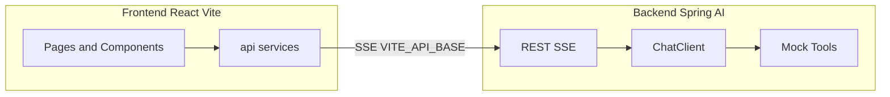

# Phase 4: Architecture Design - 架构设计

## 4.1 整体架构



### 架构说明

- **前端**：通过 `VITE_API_BASE` 访问后端；仅 `api/` 或 `services/` 内调用后端，不在组件内写死 URL
- **后端**：提供 REST + SSE 流式对话接口；错误体统一 `{ code, message, details? }`；SSE 事件类型 `message` / `done` / `error`，与前端约定一致

## 4.2 前端技术选型与 UI 规范

### 技术栈

- **框架**：React 18+、Vite 5+、TypeScript
- **路由**：React Router
- **状态管理**：React Context / useState（首版简单场景）

### 设计还原（从参考页提取的 design tokens）

#### CSS 变量

```css
:root {
  --bg-main: #0f1419;
  --bg-card: #1a2332;
  --bg-elevated: #243044;
  --accent: #00c896;
  --accent-dim: rgba(0, 200, 150, 0.15);
  --accent-soft: #00e6a8;
  --text-primary: #f0f4f8;
  --text-secondary: #8b9cb3;
  --text-muted: #5c6b7e;
  --border: rgba(139, 156, 179, 0.12);
  --danger: #ff6b6b;
  --warning: #ffb347;
  --success: #00c896;
}
```

#### 字体

- 主字体：DM Sans（Google Fonts）
- 等宽字体：JetBrains Mono（用于日期/数字）

#### 布局

- **根层**：`App` 为 flex，高度 100vh
- **左侧**：`Sidebar` 固定 240px
  - Logo区域
  - 导航区域（首页、自动化、工具栏）
  - 对话历史
  - 用户区
- **右侧**：`MainArea` 为 flex 列
  - `main-header`：标题区 + 创建对话按钮
  - `main-content`：内容区
    - 首页模式：欢迎语 + 操作指引
    - 对话模式：消息列表（可滚动）+ 底部输入区

### 关键页面/组件

#### Layout

- `Layout.tsx`：根布局（Sidebar + MainArea）
- `Sidebar.tsx`：侧栏组件
- `MainArea.tsx`：主区组件

#### 页面

- `HomeView.tsx`：首页（欢迎语、操作指引 01～04）
- `ChatView.tsx`：对话页面（消息列表 + 输入栏）

#### 组件

- `MessageList.tsx`：消息列表
- `MessageBubble.tsx`：消息气泡（用户/AI）
- `ChatInput.tsx`：输入框
- `QuickAsk.tsx`：快捷提问

#### 样式

- 消息气泡：`.user-bubble`、`.ai-reply`
- 快捷提问：`.quick-ask`
- 与参考页样式对齐

## 4.3 后端技术选型与模块

### 技术栈

- **Java**：21+
- **Spring Boot**：4.x
- **Spring AI**：2.0.0-M2+（OpenAI/Anthropic starter）
- **Spring WebFlux**：用于 SSE 流式响应

### 包结构

```
com.researchagent
├── api/
│   └── ChatController.java        # REST 入口
├── config/
│   ├── ChatClientConfig.java      # ChatClient Bean、工具注册
│   └── CorsConfig.java            # CORS 配置
├── tools/
│   ├── StoreSummaryTool.java      # Mock 工具：门店经营摘要
│   └── FinanceDiffTool.java       # Mock 工具：金蝶凭证差异
└── Application.java                # 主类
```

### 核心组件

#### ChatController

- `POST /v1/chat`：流式对话接口（SSE）
  - 请求体：`{ "message": string, "sessionId"?: string }`
  - 响应：SSE 流（`message` / `done` / `error`）
- `GET /v1/health`：健康检查

#### ChatClient 配置

- 使用 `ChatClient.Builder`
- 配置 `defaultTools(MockTools...)`
- 可选 `defaultAdvisors(MessageWindowChatMemory...)`
- 系统提示：说明「门店智能体助手」及可调用的 Mock 工具用途

#### SSE 契约

- `Content-Type: text/event-stream`
- 事件类型：
  - `message`：data 为增量文本或 JSON
  - `done`：流结束
  - `error`：data 为统一错误体 `{ code, message, details? }`
- 与前端解析一致

## 4.4 MCP / 业务系统 Mock 策略

### 首版策略

不接真实 MCP 服务端；在后端 `tools/` 中实现 2 个 Mock 工具。

### Mock 工具定义

#### 1. StoreSummaryTool

- **名称**：`get_store_summary`
- **描述**：获取门店经营摘要，包括销售额、客流、待办数量等
- **参数**：
  - `storeCode`（可选）：门店编码，默认返回示例门店
- **返回**：JSON 对象
  ```json
  {
    "storeCode": "A01032",
    "storeName": "菜湖店",
    "todaySales": 12580.00,
    "customerFlow": 342,
    "avgPrice": 36.8,
    "lossRate": 2.1,
    "pendingTasks": 23
  }
  ```

#### 2. FinanceDiffTool

- **名称**：`get_finance_diff`
- **描述**：获取销售凭证与金蝶凭证差异列表
- **参数**：
  - `month`（可选）：月份，格式 YYYY-MM，默认当前月
- **返回**：JSON 数组
  ```json
  [
    {
      "voucherNo": "V202501001",
      "salesAmount": 1250.00,
      "kingdeeAmount": 1250.00,
      "diff": 0.00,
      "status": "matched"
    },
    {
      "voucherNo": "V202501002",
      "salesAmount": 3200.00,
      "kingdeeAmount": 3100.00,
      "diff": 100.00,
      "status": "mismatched"
    }
  ]
  ```

### 后续替换

为每个 Mock 工具定义清晰接口（入参/出参）；后续接入真实 MCP 或内部 API 时，仅替换工具实现，Controller 与 ChatClient 配置不变。

## 4.5 接口与契约摘要

| 维度 | 约定 |
|------|------|
| 前端环境变量 | `VITE_API_BASE` 指向后端 Base URL |
| 健康检查 | `GET /v1/health` 返回 200 |
| 流式对话 | `POST /v1/chat`，Body: `{ "message": string, "sessionId"?: string }`；响应 SSE：`message` / `done` / `error` |
| 错误体 | `{ "code": string, "message": string, "details"?: unknown }` |

## 4.6 实现步骤

1. **后端搭建**
   - 创建 Spring Boot 项目
   - 引入 Spring AI + WebFlux 依赖
   - 实现 `ChatController`（SSE）
   - 实现 2 个 Mock 工具
   - 配置 ChatClient
   - 提供 `.env.example`

2. **前端搭建**
   - 创建 Vite + React + TS 项目
   - 实现 design tokens（CSS 变量）
   - 实现 `Layout`（Sidebar + MainArea）
   - 实现 `HomeView`
   - 实现 `ChatView`
   - 实现 `api/chat`（SSE 调用）

3. **联调**
   - 本地同时启动后端与前端
   - 验证新建会话、发送消息、流式输出
   - 检查 CORS、SSE 事件名与 data 格式

4. **质量审查**
   - 正确性检查
   - 安全性检查
   - 规范检查
   - 可维护性检查

## 4.7 目录结构（完整）

### 项目根目录

```
research-agent/
├── backend/                    # 后端模块
│   ├── src/main/java/com/researchagent/
│   ├── src/main/resources/
│   └── pom.xml
├── frontend/                   # 前端模块
│   ├── src/
│   ├── public/
│   ├── vite.config.ts
│   └── package.json
├── docs/
│   └── feature-dev/research-agent/
├── README.md
└── .gitignore
```
